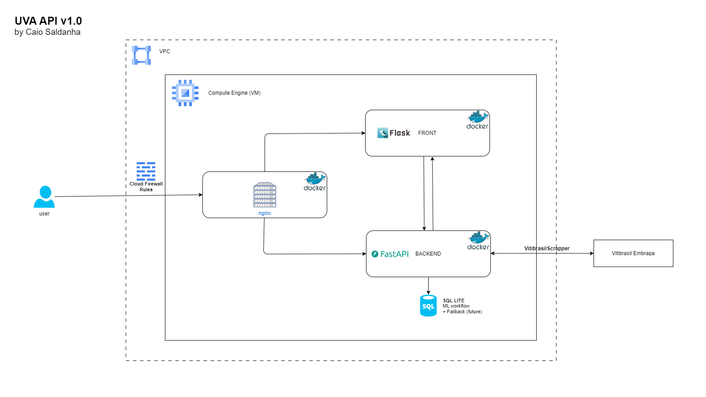

# UVA API – 1.0.0

**Author**: [Caio Saldanha](http://caiosaldanha.com)  
**Contact**: [hello@caiosaldanha.com](mailto:hello@caiosaldanha.com)

---

## Table of Contents

1. [Overview](#overview)  
2. [Project Description](#project-description)  
3. [Features & Items](#features--items)  
4. [Usage](#usage)  
5. [Installation & Setup](#installation--setup)  
6. [Project Architecture](#project-architecture)  
7. [Folder Structure](#folder-structure)  
8. [Tech Stack](#tech-stack)  
9. [License](#license)

---

## Overview

UVA API is a FastAPI + Flask project designed to **retrieve, process, and serve** data on grape-derived products produced in Brazil (with a particular focus on Rio Grande do Sul). The API allows you to easily obtain DataFrames for wines, juices, and grape derivatives from **1970 through 2023**, and can be extended for future years.

---

## Project Description

This API performs **online data retrieval** of wine, juice, and derivative production in Brazil. Built with **FastAPI** for back-end data endpoints and a minimal **Flask** front-end, it provides a quick and convenient way to:

- Download data for **Production** of wines, juices, and derivatives in Rio Grande do Sul.
- Access aggregated data for the **Processing** of grapes (Vinifera, American & Hybrid, Table grapes, etc.).
- Retrieve **Commercialization** (sales) data of wines and derivatives in the region.
- Obtain data about **Importation** and **Exportation** of grape derivatives like table wines, sparkling wines, fresh grapes, raisins, and grape juice.

---

## Features & Items

1. **Production**  
   Retrieves data about the production of wines, juices, and derivatives in Rio Grande do Sul.

2. **Processing**  
   Retrieves the amount of grapes processed (Vinifera, American/Hybrid, Table grapes, Unclassified).

3. **Commercialization**  
   Retrieves the commercialization (sales) data of wines and derivatives within Rio Grande do Sul.

4. **Importation**  
   Retrieves import data of grape derivatives such as table wines, sparkling wines, fresh grapes, raisins, and grape juice.

5. **Exportation**  
   Retrieves export data of grape derivatives, including table wines, sparkling wines, fresh grapes, and grape juice.

Each item can be requested by specifying a **year** between 1970 and 2023 (inclusive), and the API will return the relevant DataFrame.

---

## Usage

With UVA API, you can:

- **Retrieve a DataFrame** for each item, complete with all relevant subitems.
- **Retrieve yearly data** for the items listed above, spanning from **1970 to 2023**.
- Integrate these DataFrames into your own data science or analytics workflows.

**Example Endpoint Usage** (Production for 2023):
```
GET /api/v1/production/2023
```

---

## Installation & Setup

### 1. Clone the Repository
```bash
git clone https://github.com/yourusername/uva-api.git
cd uva-api
```

### 2. Run with Docker Compose
The project includes a `docker-compose.yml` that orchestrates the FastAPI (back end) and Flask (front end) services.

```bash
docker-compose up --build
```

This command:
- Builds the FastAPI + Flask images.
- Starts containers for both.
- Exposes the relevant ports for you to interact with the API.

### 3. Verify the Services
Open your browser (or an API testing tool like [Postman](https://www.postman.com/) or [VS Code REST Client](https://marketplace.visualstudio.com/items?itemName=humao.rest-client)):

- **FastAPI** is generally available at:  
  ```
  http://localhost:8000
  ```
- **Flask (Front End)** is generally available at:  
  ```
  http://localhost:5000
  ```

*(Port numbers can vary if changed in the `docker-compose.yml`.)*

---

## Project Architecture

### High-Level Diagram


1. **Front End (Flask)** – A simple user-facing interface for any basic views or demos.  
2. **Back End (FastAPI)** – Responsible for:
   - Scraping or retrieving the data (via `vitibrasilscraper.py`).
   - Serving endpoints (`production`, `processing`, etc.).
   - Returning data in a DataFrame-friendly format (JSON or CSV).
3. **Services** – Reusable business logic (e.g., data fetching, transformations).
4. **External Data Source** – The Vitibrasil website data is scraped or downloaded, then stored or cached locally if needed.

---

## Folder Structure

```bash
uva-api/
├── docker-compose.yml
├── uva-api.py                 # Entry point for the application (FastAPI)
├── files/
│   └── test.http              # VS Code REST Client test file
├── routes/
│   ├── welcome.py             # Root endpoint: /
│   ├── production.py          # /api/v1/production/{year}
│   ├── processing.py          # /api/v1/processing/{year}
│   ├── commercialization.py   # /api/v1/commercialization/{year}
│   ├── importation.py         # /api/v1/importation/{year}
│   └── exportation.py         # /api/v1/exportation/{year}
├── services/
│   └── vitibrasilscraper.py   # Business logic and web scraping
└── ...
```

- **`uva-api.py`**: The main FastAPI entry point.  
- **`routes/`**: Contains the various API endpoints grouped by functionality.  
- **`services/`**: Contains the core logic for data retrieval, transformations, or scraping.  
- **`files/test.http`**: Sample requests for local testing with the VS Code REST Client extension.

---

## Tech Stack

- **FastAPI**  
  Used to implement the back-end API, providing endpoints to retrieve data.  
- **Flask**  
  A simple front-end or minimal UI layer.  
- **Docker & Docker Compose**  
  Simplifies environment setup and deployment.

*(Additional libraries may include Pandas, Requests, Beautiful Soup for scraping, etc.)*

---

## License

**Apache 2.0**  
[http://www.apache.org/licenses/](http://www.apache.org/licenses/)

Feel free to use, modify, and distribute under the terms of this license.

---

**Happy Data Gathering!**

For any questions or contributions, please contact:  
[**hello@caiosaldanha.com**](mailto:hello@caiosaldanha.com) or visit [**caiosaldanha.com**](http://caiosaldanha.com)